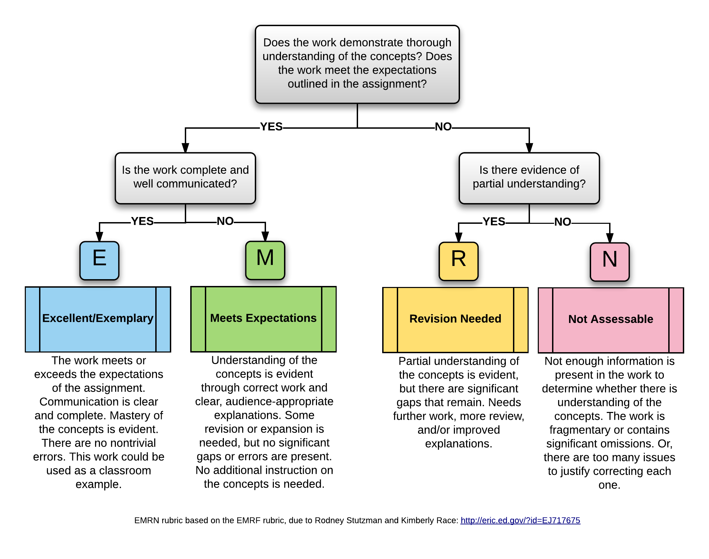

```{r setup, include=FALSE}
knitr::opts_chunk$set(echo = FALSE)
```

## Deadlines: 

- You should fill our your group membership form by Monday, November 15 at 8:30 a.m.

- You should push your final project to to GitHub by 3:30 p.m. on Tuesday, November 23

- You should complete your group assessment form by 10 a.m. Wednesday, November 24

## Project description

The goal of the project is to go through the complete data-scientific process to answer questions you have about some topic of your choosing. You will need to acquire and wrangle your data, design your visualizations, run analyses (which could be visualizations), and communicate the results. The project is an opportunity to show off what you have learned about data science! Your task is to use data to tell me something interesting. This project is deliberately open-ended to allow you to fully explore your creativity. Here are the main rules that must be followed:

**Create a website or Shiny app.** The website/app will be your platform to communicate what you have learned.

**Create a brief technical report.** Create a brief write-up for me (not on the website) that explains your methodology for your website/app creation. Include a *brief* explanation of the class tools/methods you used and any new tools/methods used. This does not need to be a step-by-step explanation, rather it should give me a roadmap for your R code file(s).

**Create a five-minute screencast.** This is your change to present your key findings to me "in person."

**Use the materials learned in this class.** Both the computational and statistical tools learned.

**Your project must be centered around real data.** You will work with large, complex, and/or messy data. While this is not an explicit requirement of the project, the more challenging your data set is, the more you will have to use the tools learned in this class. For example, one thing that will make your data science project more ambitious is combining two or more data sets that are not directly related. To get full marks, you need to use data that was not accessible to you as a Math 215, 245 or 275 student. (You may want to rethink your project if you could have used your data for a final project in one of those courses.)

**Your project must tell me something.** An example of a project that doesn't tell me anything would be something that downloads a single data source and summarizes it, with some perfunctory visualization. Make sure that your project is thought-provoking and has some underlying meaning!

**Exploring new tools and creativity will be rewarded.** Going above and beyond what we did in class will be rewarded. For example, you may want to learn about decision trees and random forests and use them as you classifier, to create all of your graphics using `plotly`, or to create animations using `gganimate`.


## Products

1. **Web-based presentation of results:** Place the URL of your site in your GitHub repo's README file 
    - You could create a [google site](https://sites.google.com/a/carleton.edu?pli=1), [github page](https://pages.github.com/), [RPubs page](https://rpubs.com/) or a *free* [Shiny web app page](https://www.shinyapps.io/).  
    - Here is a R Markdown reference for [formatting .Rmd as HTML pages](https://bookdown.org/yihui/rmarkdown/rmarkdown-site.html#a-simple-example)
        - and they have info for creating an [.Rmd for Github Pages](https://resources.github.com/whitepapers/github-and-rstudio/)
    - Here are some examples of how you could present your work on a (github built) website:
        - http://cs109hubway.github.io/classp/
        - http://hamelsmu.github.io/AirbnbScrape/
        - https://claralivingston.shinyapps.io/Bachelor/
        - https://yicheng-shen.shinyapps.io/DS_Final_Project/

3. **Project Screencast**

    Each team will create a five minute screencast with narration showing a demo of your Shiny app, website, or some slides. You can download Panopto to do this free from ITS. Information about how to use Panopto to prepare these screencasts can be found [here](https://apps.carleton.edu/campus/its/services/learning/lecture-capture/). Please make sure that the sound quality of your video is good. If you use a different video capture platform, then please upload it to Panopto and either embed the video in your website/app, or share the link in your README file.
    
    Use principles of good storytelling and presentations to get your key points across. Focus the majority of your screencast on your main contributions rather than on technical details. What do you feel is the best part of your project? What insights did you gain? What is the single most important thing you would like your audience to take away? Make sure it is upfront and center rather than at the end!


4. **Code and data on GitHub**
    - Data: make sure to provide your data, if it is too large for GitHub, then store it in Dropbox or Google drive and put the share link in your repo's README file
    - .Rmd/.R files: in the README, provide a list of file names in your repo along with a brief description of their content or use in your project. Please do not include files that aren't needed to complete your project!
    
    
5. **Peer assessment Google form:** Link will be added later


## Rubric

While grading your projects I will focus on the following aspects. Each is worth 10 points, and you can think of the scale as follows: 10 = Excellent; 7 = meets expectations; 5 = Revision needed; 2 = Not assessable; 0 = Did not complete.

```{r echo=FALSE}

```


1. *Project Scope.* Did you choose the appropriate complexity and level of difficulty of your project?

2. *Background and motivation.* Appropriate background information is discussed to understand the research question for someone unfamiliar with the topic, and you have clearly communicated why your research question is interesting.

3. *Data description.* It is clear what information your data set contains, as well as the source(s).

4. *Methodology.* A clear and concise description of the methods used in your project is given. This cloud include: data collection and cleaning, development of complex visualizations (if they are non-obvious to a data-literate reader), and modeling.

5. *Implementation.* All methods are correctly implemented; that is, the results are correct with no flaws.

6. *Discussion/interpretation of results.* Findings are clearly discussed and follow logically from the results.

7. *Coding style and quality.* Code is well written, organized, and commented. A consistent coding style, such as the tidyverse style guide, is followed. A randomly selected Stat 220 student could read the code and understand the implementation.

8. *Presentation.* The website and screencast are clear and engaging. All visualizations are informative, insightful, and visually appealing. All tables are formatted (no raw output!), informative, insightful, and visually appealing. The writing is clear and without any mechanical errors.

9. *Submission.* The project was submitted on time via GitHub, was complete and well organized. I should be able to easily navigate to your webpage based on a URL in the README file, and all code and data necessary to replicate your analysis is organized in the repo. 

The following aspects will be graded on a 5-point scale (E = 5, M = 4, R = 2, N = 0):

10. *Creativity.* Awarded based for creativity and/or sophistication of the methodology. These points could be awarded for, but are not limited to:

    * Outstanding visualizations that are unusually artistic, insightful,        and/or challenging to produce.
    * Data collection and cleaning that is unusually complex.
    * Modeling that is unusually sophisticated or challenging.
    * An exceptionally captivating presentation of the results.
    
11. *Group evaluations.* Based on self and peer eval feedback.


## Data ideas

Some ideas for data if you are struggling to find an appropriate data set.

- Tidy Tuesday: https://github.com/rfordatascience/tidytuesday
- Data from the FiveThirtyEight website: https://github.com/fivethirtyeight
- ProPublica (look for free data): https://www.propublica.org/datastore/