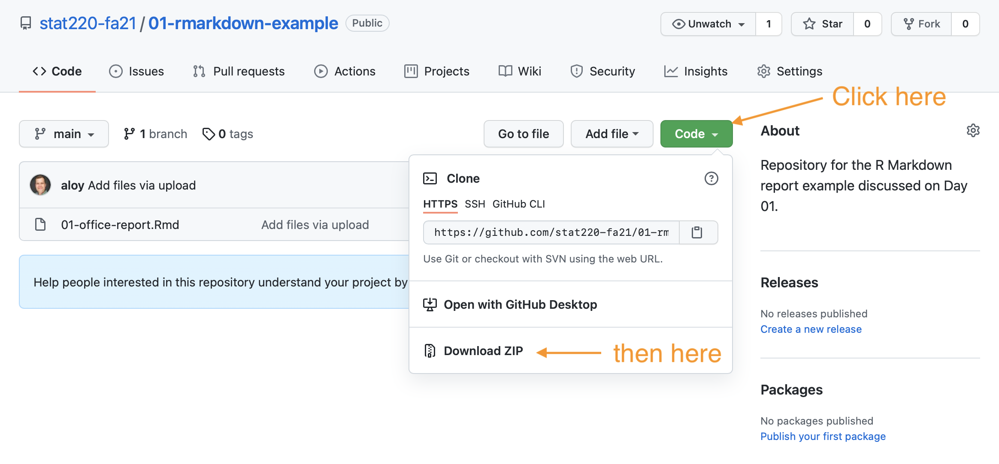

```{r setup, include=FALSE}
knitr::opts_chunk$set(echo = FALSE)

# Learn more about creating blogs with Distill at:
# https://rstudio.github.io/distill/blog.html

library(here)
library(magick)
library(magrittr)
hex_paths <- here("img", c("rstudio.png", "github.png", "rmarkdown.png"))
read_append <- hex_paths %>%
  magick::image_read() %>%
  magick::image_append()
magick::image_write(read_append, "week01.png")
```

## Wednesday, 15 Sept

### Announcements

Welcome!

### Topics/activities

Intro + R Markdown slides [html](https://stat220-fa21.github.io/class_materials/slides/01-intro) | [pdf](https://stat220-fa21.github.io/class_materials/slides/01-intro.pdf)


- What is data science?
- What is this course about?
- Getting up and running with R Markdown

[Example .Rmd report](https://github.com/stat220-fa21/01-rmarkdown-example)

To download this .Rmd, click on the green "Code" button and then "Download ZIP".

```{r echo=FALSE}

```


### Before next time

- Please [sign up for two collaborative note slots](https://docs.google.com/document/d/1xjLpsYCh0u9n-Hm7T_z2F3Kb_qo7MgnGtSB8HaFaamk/edit?usp=sharing)

- Make sure all software is installed and working

- Connect Git and GitHub following the directions in the [GitHub Classroom Guide for Stat 220](github_stat220.html)(you only need to worry about the "Getting setup with Git and GitHub" for now.)

- Read [Sections 2.2-2.13 in Irizazary](https://rafalab.github.io/dsbook/r-basics.html#the-very-basics). This reviews the basics of working with vectors in R. Feel free to skip the exercises for now, focus on reviewing the basics.

- Read [Sections 27.1-27.5 in R4DS](https://r4ds.had.co.nz/r-markdown.html#r-markdown). This reviews and expands on using R Markdown for literate programming. 

- Watch "Git and GitHub for Poets (part 1)". This introduces 
basic ideas, but we'll use RStudio to interface with Git and GitHub.

    <iframe width="560" height="315" src="https://www.youtube.com/embed/BCQHnlnPusY" title="YouTube video player" frameborder="0" allow="accelerometer; autoplay; clipboard-write; encrypted-media; gyroscope; picture-in-picture" allowfullscreen></iframe>

Optional (if you need more review):

- If you don't remember how to use R Markdown from your last statistics class, read [R and RStudio Basics](https://ismayc.github.io/rbasics-book/3-rstudiobasics.html) and [R Markdown](https://ismayc.github.io/rbasics-book/4-rmarkdown.html) from *Getting Used to R, RStudio, and R Markdown*

- If it's been a LONG time since you used R and need a crash course on the very basics, watch this [programming basics primer from RStudio](https://rstudio.cloud/learn/primers/1.2).


## Friday, 17 Sept

### Announcements

Homework 1 is due by 8:30 a.m. on Monday, September 20.

### Topics/activities

- Working with vectors and lists

- Connecting to GitHub

### Before next time

- Complete homework 1 and submit it on GitHub.

- Watch this brief overview of the layered grammar of graphics.

- Read [Sections 3.1-3.6 in R4DS](https://r4ds.had.co.nz/data-visualisation.html#introduction-1). This will introduce key `{ggplot2}` ideas.
