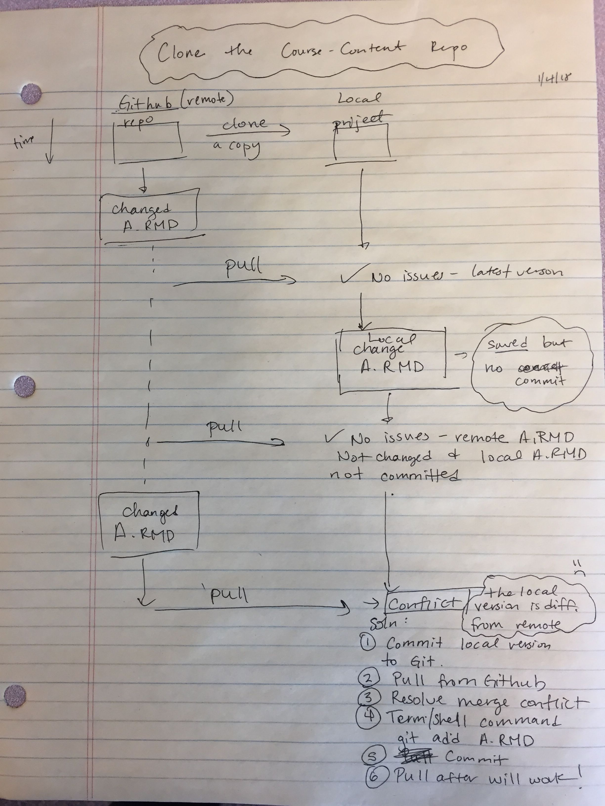

## Overview

If you are using the maize RStudio server, then you can connect to
GitHub without any extra software downloads. If you are using RStudio on
your computer, then you will need to download Git software (as directed
in [Software in Stat 220](software.md)) to use GitHub connected
projects.

I will host all of our course materials on GitHub, and you will use
GitHub to submit homework and collaborate on projects.


## Getting setup with Git and GitHub

If you are **not** working on the maize RStudio server, then make sure
that you have installed all of the software mentioned in [Software in
Stat 220](software.md). In addition, you should install the `usethis`
and `gitcreds` R packages.

Everyone needs to connect Git and GitHub by doing the following:

1.  Register for account on GitHub (<https://github.com/>). I recommend
    using a username that incorporates your name (e.g. aloy). Please use
    your Carleton email with this account.

2.  Setup options in Git by running the following code chunk in your
    console:

    ``` r
    library(usethis)
    use_git_config(user.name = "Jane Doe", user.email = "jane@example.org")
    ```

    changing the first two lines to your own name and email (this should
    be the email associated with your GitHub account).

3.  (Optional) This step explains how to use GitHub on RStudio without
    having to enter your password every time to connect. This is an
    optional step since you can still use GitHub without setting up a
    SSH key or caching credentials, you will just need to enter your
    password every time you push or pull with GitHub. Pick one method
    below: cache credentials for HTTPS or SSH. GitHub recommends HTTPS,
    so I recommend trying that first.

    -   **Strongly recommended:** Cache credential using a HTTPS linked
        project.

        Complete the steps in [Section 10.1 of Happy Git with
        R](http://happygitwithr.com/credential-caching.html) to get a
        personal access token (you will need to install the `usethis`
        package first). Then, follow the directions in [Section 10.2.1
        of Happy Git with
        R](https://happygitwithr.com/credential-caching.html#call-an-r-function-to-store-your-credentials)
        (I've had good luck with the `gitcreds` package, and it is
        installed on maize.)

    -   A second method is to generate a SSH key. First check to see if
        you have a SSH key. Go into the shell (again, through RStudio
        `Tools -> Shell`) and complete on this page
        <http://happygitwithr.com/ssh-keys.html>, which is Chapter 11 in
        Happy Git with R.

4.  **(optional)** Follow the instructions here
    (<http://happygitwithr.com/push-pull-github.html>) to ensure you can
    connect to GitHub from your computer. If you can't get this command
    line push/pull to work that is fine. Try connecting to GitHub via
    RStudio, as detailed next. If you can't connect via RStudio then
    contact me on
    [Slack](https://moodle.carleton.edu/mod/url/view.php?id=527391 "Slack")
    or talk to me in student hours.


## Individual assignments

If you followed the suggestions in the [Using Rstudio in Stat
220](rstudio_stat220.md) page, then you should already have an
assignments folder on your computer or maize account.

Each new assignment/project will be posted as a repository on GitHub and
added directly to your account (within the Stat220 organization). This
repository will contain assignment details (README, .Rmd).

### Creating an individual assignment repo and project

1.  Go to our course GitHub organization page
    (<https://github.com/stat220-fa21>) and find your homework repo, such as `hw-1-username` (where your username is attached).
2.  Enter the online assignment repository on GitHub. Click the green
    **"Code"** button. Most of you should just use the default setting
    which is to "clone" (copy) using HTTPS. Click the clipboard to the
    right of the URL to copy the repo location. (If you are using SSH,
    make sure it says "Clone with SSH" in bold in the top left of the
    pop-up box. If not, click the "SSH" button and copy the link in the
    box to your clipboard.)
3.  Now open up RStudio and create a project as follows:

-   Click the **Project** button in the upper right corner of your
    RStudio window and select **New Project...**.

\  
```{r echo=FALSE, fig.align='center', out.width = "80%"}
knitr::include_graphics("img/maize_project.png")
```

-   Select **Version Control** and then **New Project**

```{r echo=FALSE, fig.align='center', out.width="100%"}
knitr::include_graphics("img/maize_version.png")
knitr::include_graphics("img/maize_git.png")
```

-   Paste the link you just copied into the Repository URL box. Leave
    the Project directory name blank (or keep the auto-filled name). Use
    the **Browse** button to find your **assignments** folder, then
    click **Create Project**

```{r echo=FALSE, fig.align='center', out.width="100%"}
knitr::include_graphics("img/maize_clone.png")
```

\  \  

**Warning:** If you received an error in the above steps, you may have
to clone with HTTPS instead of SSH (or vice versa). You can do this by
again clicking on the "Clone or Download" button in the repository page,
then clicking "Use HTTPS" in the top right of the pop-up box. Now copy
the link and repeat this step.

### Working on your assignment

An RStudio project should now open, which will allow you to start
working on your homework assignment. You should see the project
assignment name in the top right side of Rstudio. You will probably see
a blank console screen when you open a new project. Look in the
**Files** tab for your homework .Rmd file. Click on whatever file you
want to edit (probably the .Rmd file) and edit away. Make sure that your
current assignment's project is the one open and showing in the upper
rightproject name. To **open** a project, click on the `.Rproj` file or
use the **Open Project...** option available in the upper right project
link.

#### Commits

After you make changes to the homework assignment, commit them. What are
commits you ask? Commits are essentially taking a snapshot of your
projects. Commits save this snapshot to your local version of Git
(located on your hard drive or the maize server). For example, if I make
changes to a code so that it prints "Hello world", and then commit them
with an informative message, I can look at the history of my commits and
view the code that I wrote at that time. If I made some more changes to
the function that resulted in an error, I could go back to the commit
where the code was originally working. This prevents you from creating
several versions of your homework (homework-v1, homework-v2, ...) or
from trying to remember what your code originally looked like.

You can make commits in the Git tab in RStudio.

```{r echo=FALSE, fig.align='center', out.width="100%"}
knitr::include_graphics("img/maize_gittab.png")
```

Click the **Commit** button in the Git tab. Check the boxes of the files
that you want to commit, enter your commit message (briefly state what
changes have been made), then hit **Commit**. You can read how to do
this in RStudio in more detail here:
<http://r-pkgs.had.co.nz/git.html#git-commit>.

Two things about committing.

-   You should **commit somewhat frequently**. At minimum, if you're
    doing a homework assignment, you should make a commit each time that
    you've finished a question.
-   Leave **informative commit messages**. "Added stuff" will not help
    you if you're looking at your commit history in a year. A message
    like "Added initial version of hello-world function" will be more
    useful.

#### Pushing changes to Github

At some point you'll want to get the updated version of the assignment
back onto GitHub, either so that we can help you with your code or so
that it can be graded. You will also want to push work frequently when
you have a shared GitHub repo for project collaborations (i.e. more than
one person is working on a project and code). If you are ready to push,
you can again click on the "Up" **Push** arrow in the Git tab or in the
Commit pop-up window or in the Git tab (shown above).

To "turn in" an assignment, all you need to do is push all your relevant
files to Github by the deadline.


## Group work

Collaborative Github assignments are pretty similar to individual assignments.

### Creating a group/partner assignment repo and project

Go to our course GitHub organization page(<https://github.com/stat220-fa21>) and find the repo for your group, for example if your group name is "team01" the you might find the `mp1-team01` repo. Clone this repo to your computer/maize account using the same steps done for an individual assignment (see steps 2-3).

#### Working with collaborative repos

For group homework, I suggest that only the *recorder* edit the group-homework-x.Rmd file to avoid merge conflicts! Other group members can create a new Markdown doc to run and save commands. Only the recorder needs to **push** changes (answers) to the Github repo and all others can then **pull** these changes (i.e. the final answers) after the HW is submitted.

When you are working together on a Github project, you should commit and push your modifications frequently. You will also need to frequently **pull** updates from Github down to your local version of RStudio. These updates are changes that your teammates have made since your last pull.  To pull in changes, click the "Down"  **Pull** arrow in the Git tab (shown above). 

If you get an error about conflict after pulling or pushing, don't freak out! This can happen if you edit a file (usually an .Rmd or .R file) in a location that was also changed by a teammate. When this happens you should attempt to fix the **merge conflict**. Take a look at [this resource site](http://r-pkgs.had.co.nz/git.html#git-pull) and try to fix the merge conflict in Rstudio. Katie also created a diagram shown below that "explains" how and when conflicts will likely happen and how you can resolve the problems in Rstudio. If that doesn't work contact me!

```{r echo=FALSE}

```


## Additional resources

* [Happy Git and GitHub for the useR](http://happygitwithr.com/)
* [Rstudio, Git and GitHub](http://r-pkgs.had.co.nz/git.html#git-rstudio)
* [Interactive learning guide for Git](http://learngitbranching.js.org/)
* [GitHub Guides](https://guides.github.com/)
* [Git setup for Windows (video)](https://youtu.be/F_fPEMnr1OQ)
* [Git setup for Mac (video)](https://www.youtube.com/watch?v=kbmSZwK0k-A&t)
* [How to clone, edit, and push homework assignments with GitHub Classroom (video)](https://youtu.be/pAcMgGbCtQw)


## Acknowledgements {.appendix}

Most of this content in this guide was taken from
<https://github.com/jfiksel/github-classroom-for-students> and edited
for our classroom use. 

## Reuse {.appendix}

This guide is licensed under the CC BY-NC 3.0 Creative
Commons License.
