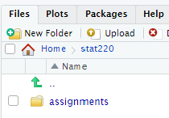
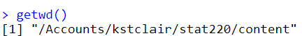

## Key idea: Make a Stat220 folder

There will be a lot of Rstudio content thrown your way this term, most in the form of .Rmd Markdown files. To stay organized, I *strongly* suggest you create a **stat220** folder that contains the following subfolders:

- **stat220** folder
    - **Assignments:** This folder will contain subfolders for each assignment. Each assignment subfolder (e.g. homework1, homework2, ...) will be a Github connected RStudio project that you will create **once an assignment is posted.** 
    
    - **Content:** This folder should be used to save any non-assignment files (e.g. slides, examples) for this class. You will create this subfolder by creating an RStudio project (see step 5 below). 

To get started with this organization, follow the steps below. 


## File organization: Using maize

The server (online) version of Rstudio is run from a unix server. You can navigate this file system using unix commands, but I assume that most or all of you will just use Rstudio to access your files on this server. 

**1.** In Rstudio, click the **Files** *tab* in the lower righthand window. Note: this is **not** the same as the **File** *menu* option.

```{r echo=FALSE, fig.align='center'}
knitr::include_graphics("img/maize_files.png")
```


**2.** Verify that you are in your **HOME** folder (should simply say Home right under the New Folder button). To navigate to your Home folder (if somehow you are not in it), click the **...** button (far right side of the **Files** tab) and enter a ~ (tilde) symbol 


```{r echo=FALSE, fig.align='center'}
knitr::include_graphics("img/maize_home.png")
```


**3.** Click the **New Folder** button and name the folder **stat220**. 
```{r echo=FALSE, fig.align='center'}

```


**4.** Click on this newly created (empty) **stat220** folder. Within the folder create another **New Folder** and  name it **assignments**.


```{r echo=FALSE, fig.align='center'}

```

**5.** Within the **stat220** folder, create an **RStudio project** called **content** with the following steps:

  - **a.** Click  the **Project** button in the upper right corner of your RStudio window and select **New Project...**.

```{r echo=FALSE, fig.align='center'}
knitr::include_graphics("img/maize_project.png")
```

  
  - **b.** Select  **New Directory** and then **New Project**

```{r echo=FALSE, fig.align='center', out.width='50%'}
knitr::include_graphics("img/maize_newdirectory.png")
knitr::include_graphics("img/maize_newdirectory2.png")
```

  
  - **c.** Enter **content** as the **Directory name** and use the **Browse** button to find your **stat220** folder. Then click **Create Project**.

```{r echo=FALSE, fig.align='center', out.width='50%'}
knitr::include_graphics("img/maize_create.png")
```

  
  - **d.** You should now have a new folder called **content** in your **stat220** folder and this folder will contain an RStudio project `.Rproj`. Feel free to add subfolders to this **content** folder (e.g. slides, examples, etc).

```{r echo=FALSE, fig.align='center'}

```


**Warning: Do not** create an RStudio project in the main stat220 folder because it is not good practice to have RStudio projects in subfolders of another project (e.g. a project within a project is not recommended). 


## File organization: Using your own Rstudio install

Create a folder called **stat220** somewhere on your computer. Within this folder create an **assignments** subfolder. Then complete **step 5** from above to create a **content** RStudio project folder.


## RStudio projects

Once you've created a project, your R session should be running within that project folder. You can check which project you are in by checking the project name in the upper right part of your RStudio window. Here we see the **content** project is open:

```{r echo=FALSE, fig.align='center'}
knitr::include_graphics("img/maize_content.png")
```

Running R from an RStudio project sets your **working directory** to the project folder: 

```{r echo=FALSE, fig.align='center'}

```

This allows for easy file path access to all files related to this project. 

To **start** a project, click on the `.Rproj` file or use the **Open Project...** option shown in step 5 above. 


## Best practices  (or what not to do)

- Never save files to a lab computer hard drive (e.g. desktop, downloads, etc). They will be erased when you log off. 
- Do not use gmail as a file storage system! Avoid emailing yourself files that you created (and saved) on a lab computer. Eventually you will lose work this way.
- Avoid using online versions of google drive and dropbox. Similar to gmail, downloading, editing a doc, then uploading it back to drive/dropbox is another great way to lose work. 
- Avoid [this](https://xkcd.com/1459/), [this](http://phdcomics.com/comics.php?f=1531), and [this](https://www.datamation.com/imagesvr_ce/3829/version-control.jpg).


## Acknowledgments {.appendix}
This installation guide is based on the guide from Katie St. Clair

## Reuse {.appendix}


Text and figures are licensed under Creative Commons Attribution CC BY-NC 3.0.

